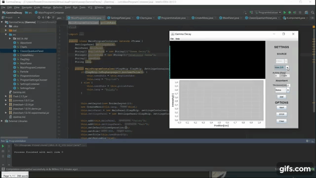

# Gamma Decay

This is a Java Swing app made while studying at the Warsaw University of Technology

Made in the late 2014'.

## Quick description

* Select the language.
* Select the emitter properties.
* Select the absorbent properties and add it to the scene.
* An alert will come up once the gamma radioation intensity is less then 1 bq/g

Check it out:

## Notes

We were not taught how to code in a proper manner, so there are multiple workarounds, and some silly ideas:
* I've put all flags in a flagship class instance and passed it everywhere. I guess I was into pirates.
* GUI is tragic, but I guess that was not the point of doing this simulation.

## Built With

* Eclipse, now i switched to intelliJ

## License

This project is licensed under [MIT license](LICENSE)

